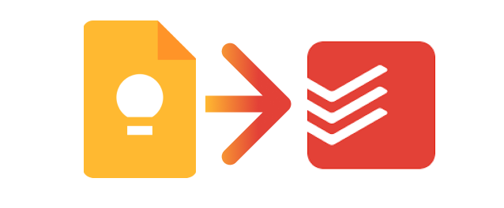
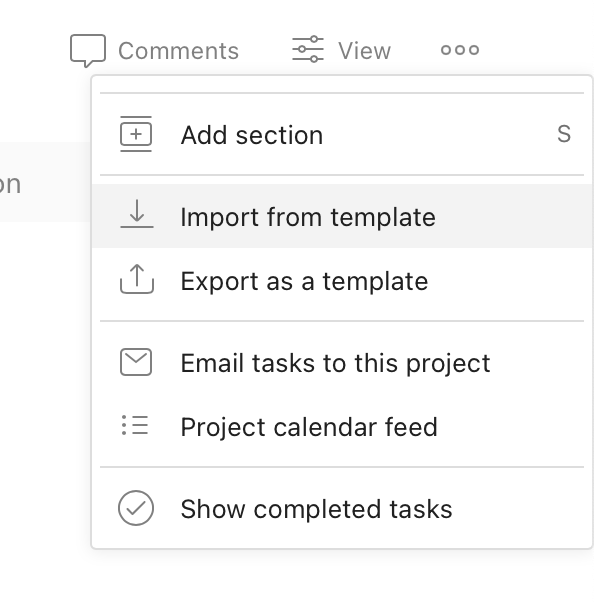

# Google Keep Scraper to Todoist
Apparently there's no simple way to export your notes from Google Keep to CSV. 
This script accepts the Keep folder Google Takeout archive, and outputs all of the Keep notes as lines in a 
single CSV file.

This fork modifies the CSV output to todoist format for easy importing. CSV structure is based on the [todoist documentation](https://todoist.com/help/articles/how-to-format-your-csv-file-so-you-can-import-it-into-todoist).   

| column  (case sensitive)| defined in the conversion? |
| --- | --- |
| TYPE | Yes |
| CONTENT | Yes |
| DESCRIPTION | Yes |
| PRIORITY | Yes, 4 (lowest) |
| INDENT | Yes, only for subtasks |
| AUTHOR | No |
| RESPONSIBLE | No |
| DATE | No |
| DATE_LANG | No |
| TIMEZONE | No |
| meta | view_style=board |

## Install
1. Clone or download this repository
1. Open a terminal to the repository folder (`google-keep-to-todoist`)
1. Run `pip install -r requirements.txt` to install dependencies

## Export Keep notes
First we need to download all the Keep files through Google Takeout.
1. Go to [Google Takeout](https://takeout.google.com/settings/takeout)
2. Make sure the 'Keep' checkbox is selected (you can deselect all others)
3. Download and export the archive to a folder that has the 'Keep' folder
4. Move the `Keep` folder into this folder, so it's alongside `keep.py`
5. If you have multiple Takeout folders, move the `.html` files within each `Keep` folder so they are all in the same `Keep` folder.   

## Convert Keep files to one Todoist csv file
All of your Keep notes will be exported to CSV in the same folder
1. Run `python keep.py`

## Import notes csv to Todoist

In the top right of Todoist, click the three dots then "Import from template"

### Limitations:
* The Todoist CSV structure does not allow for assigning tasks to projects, defining users to share the tasks with, or adding labels to the task.
* Additionally, while an image can be pasted in manually to a task comment, there is no way to move Keep media to Todoist via a csv import.   

## Troubleshooting
If you get an error about a missing dependency, be sure to run `pip install -r requirements.txt` prior to running the script so that it can download the dependencies needed.

## Unofficial Status
This script is not affiliated with Google or Todoist. 
